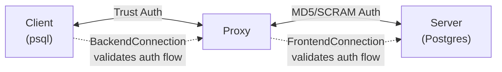
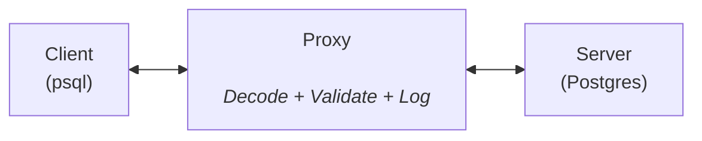

# Authentication Proxy

This example demonstrates how to build a PostgreSQL proxy that handles authentication on behalf of clients, allowing them to connect without providing credentials.

## Overview

The authentication proxy acts as a middleman between PostgreSQL clients (like `psql`) and a real PostgreSQL server:

1. **Client → Proxy**: Clients connect using `trust` authentication (no password required)
2. **Proxy → Server**: Proxy authenticates to the real server using `MD5` or `SCRAM-SHA-256`
3. **Message Forwarding**: All messages are decoded, logged, and forwarded

## Use Cases

- **Testing**: Validate pygwire's codec and state machines for authentication flows
- **Learning**: Understand PostgreSQL authentication protocols (`MD5`, `SCRAM-SHA-256`, `trust`)
- **Debugging**: Inspect all protocol messages with full visibility
- **Middleware**: Build authentication layers or connection poolers
- **Security**: Centralize database credentials instead of distributing them to clients

## Design

The proxy uses pygwire's `Connection` classes, which coordinate decoding and state machine validation together throughout the entire connection lifecycle.

### Authentication Phase

During startup and authentication, the proxy actively participates in the protocol:

- **Decodes messages** to intercept and handle authentication
- **Uses state machines** (via Connection classes) to validate protocol flow and catch errors
- **Constructs messages** to send trust auth to client, real auth to server



### Query Phase

After authentication, the same Connection objects continue to decode, validate, log, and forward messages bidirectionally:



The Connection classes handle both phases. State machine validation catches protocol errors at any point, and message logging provides full visibility for debugging.

## Usage

### Configuration

Configure the proxy using environment variables:

```bash
export PROXY_PORT=5433                              # Port proxy listens on
export PROXY_SERVER_HOST=localhost                  # Real PostgreSQL server
export PROXY_SERVER_PORT=5432                       # Real server port
export PROXY_SERVER_SSL=true                        # Use SSL to server
export PROXY_SERVER_USER=myuser                     # Server username
export PROXY_SERVER_PASSWORD=mypassword             # Server password
export PROXY_SERVER_DATABASE=mydb                   # Server database
```

### Running the Proxy

```bash
python examples/auth_proxy.py
```

Output:
```
11:06:54 [INFO] Proxy listening on ('0.0.0.0', 5433)
11:06:54 [INFO] Forwarding to PostgreSQL at localhost:5432
11:06:54 [INFO] Server: SSL=True, User=myuser, DB=mydb
11:06:54 [INFO] Clients will use trust auth, proxy will authenticate to server
11:06:54 [INFO] Press Ctrl+C to stop
```

### Connecting Through the Proxy

Connect with any PostgreSQL client without providing credentials:

```bash
# psql (no password needed)
psql -h localhost -p 5433 -U anyuser mydb

# Python with psycopg2
import psycopg2
conn = psycopg2.connect(
    host="localhost",
    port=5433,
    user="anyuser",
    database="mydb"
    # No password
)
```

### Example Session

```bash
$ psql -h localhost -p 5433 -U testuser testdb
psql (15.16, server 15.12)
Type "help" for help.

testdb=> SELECT version();
                                                 version
─────────────────────────────────────────────────────────────────────────
 PostgreSQL 15.12 on x86_64-pc-linux-gnu, compiled by gcc (GCC) 11.2.0
(1 row)

testdb=> \q
```

Proxy logs show all protocol messages:

```
11:07:00 [INFO] [127.0.0.1:65244] New connection from ('127.0.0.1', 65244)
11:07:00 [INFO] [127.0.0.1:65244] Server SSL response: SUPPORTED
11:07:00 [INFO] [127.0.0.1:65244] SSL handshake complete
11:07:00 [INFO] [127.0.0.1:65244] Server authenticated!
11:07:00 [INFO] [127.0.0.1:65244] Client startup: user=testuser, db=testdb
11:07:00 [INFO] [127.0.0.1:65244] Client authenticated with trust auth
11:07:05 [INFO] [127.0.0.1:65244] → Query (query="SELECT version();...")
11:07:05 [INFO] [127.0.0.1:65244] ← RowDescription
11:07:05 [INFO] [127.0.0.1:65244] ← DataRow
11:07:05 [INFO] [127.0.0.1:65244] ← CommandComplete (tag=SELECT 1)
11:07:05 [INFO] [127.0.0.1:65244] ← ReadyForQuery (status=IDLE)
```

## Implementation Details

### Key Components

**`AsyncFrontendConnection` / `AsyncBackendConnection`** - Async wrappers around pygwire's `FrontendConnection` and `BackendConnection` classes that add:

- Async I/O via `asyncio.StreamReader` / `asyncio.StreamWriter`
- `on_send()` hook to automatically write to the stream
- `recv_messages()` async generator for reading and decoding messages
- State machine tracking built in via the `Connection` base class

**`ProxyConnection`** - Manages a single client connection:
- Connects and authenticates to real PostgreSQL server
- Handles client startup with `trust` authentication
- Proxies messages bidirectionally with decoding and logging

### SSL Negotiation

The proxy supports SSL/TLS connections to the backend server:

```python title="examples/auth_proxy.py" linenums="365"
--8<-- "examples/auth_proxy.py:365:388"
```

### Authentication

The proxy supports multiple authentication methods when connecting to the backend server:

**MD5 Password Authentication:**
```python title="examples/auth_proxy.py" linenums="399"
--8<-- "examples/auth_proxy.py:399:410"
```

**SCRAM-SHA-256 Authentication:**
```python title="examples/auth_proxy.py" linenums="412"
--8<-- "examples/auth_proxy.py:412:435"
```

The Connection classes validate the protocol flow via their built-in state machines throughout the entire connection lifecycle.

### Message Forwarding

After authentication, messages continue to be decoded, validated, and logged as they are forwarded:

```python title="examples/auth_proxy.py" linenums="272"
--8<-- "examples/auth_proxy.py:272:320"
```

The Connection classes coordinate decoding and state machine validation automatically, so the proxy code only needs to log and forward.

## Source Code

The complete source code is available at [`examples/auth_proxy.py`](https://github.com/DHUKK/pygwire/blob/main/examples/auth_proxy.py).

## Further Reading

- [Connection Guide](../guide/connection.md)
- [PostgreSQL Wire Protocol](https://www.postgresql.org/docs/current/protocol.html)
- [State Machine Guide](../guide/state-machine.md)
- [Codec Guide](../guide/codec.md)
